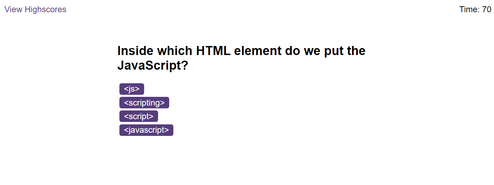
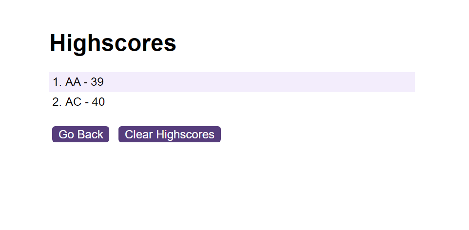

# javascript-quiz
A timed javascript quiz application. As the user works through the problems, points are deducted from the timer when a wrong answer is selected. Finally, the final scores of each game is stored in local storage and displayed at the end of the game.

## Application

https://aashroff.github.io/javascript-quiz/

## Demo

## Usage

1) Start the quiz by clicking on the start quiz button.